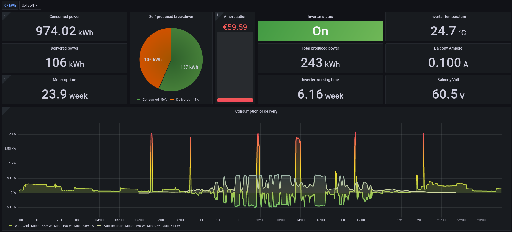
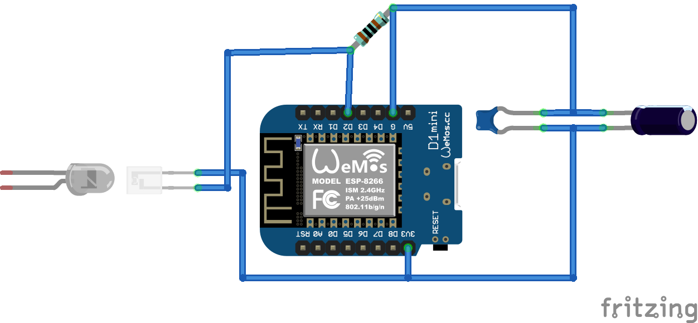
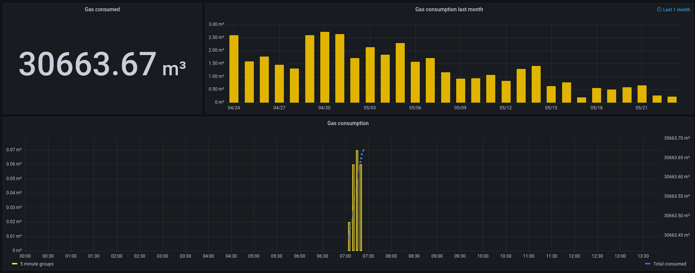
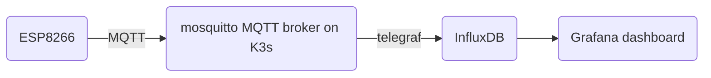

# home-monitoring

Project to monitor electricity, water and natural gas consumption. Hardware is a D1Mini ESP8266 microcontroller development board for electricity and gas, water would be based on the ESP32-CAM board.



We have a small (max. 600 W) solar power plant on our balcony. So the negative consumption and the 'self produced breakdown' as well as the other data on the right comes from this. Luckily there is a very nice project for our inverter called [grott](https://github.com/johanmeijer/grott). So we get the data directly via MQTT in our local network.

## Commodities

### Electricity

Currently code for power meters 'Holleytech DTZ 541-ZEBA' (2021) and 'Easymeter Q3MA' is available.
For the Holleytech the date/version is important since the SML byte order has changed from 2019 to 2021 version.

#### Sensor

As a write-read head I use a [Osram SFH 3100 F](https://www.osram.com/ecat/Radial%20Mini%20Sidelooker%20SFH%203100%20F/com/en/class_pim_web_catalog_103489/prd_pim_device_2219661/) phototransistor and 1 kOhm resistor. For testing purposes I cut a hole into a piece of cardboard at the position of the diode of the power meter. The first examples I did with an Arduino Uno for byte sequence debugging.

Current setup consists of two pieces of stripboard. One holds the transistor and the other one the D1Mini plus pulldown resistor connected with a pair of short cables. (Image is wrong regarding the pulldown resistor.)



### Gas

#### Sensor

The sensor is a simple reed switch or reed contact. The last number on the meter contains a magnet which increments the gas meter count by 0.01 m³ when it passes the zero. I used the debounce example of the Arduino IDE and extended it by WiFi manager and MQTT client for value submission.



### Water

Not started yet.

## Data processing

My approach is completely based on a K3s cluster on Raspberry Pis (because it is already available), but native or docker deployments works also. For an external setup I use a Ubuntu EC2 instance on the Amazon AWS cloud with docker-compose. 



### Storage (InfluxDB)

Create namespace

```bash
kubectl create namespace home-mon
```

Add helm repository

```bash
helm repo add influxdata https://helm.influxdata.com/
```

Install InfluxDB

```bash
helm install influx influxdata/influxdb \
        --set image.tag=1.8.10 -n home-mon
```

## Credits

* https://fullstackenergy.com/mqtt-into-influx/
* https://makesmart.net/esp8266-d1-mini-mqtt/