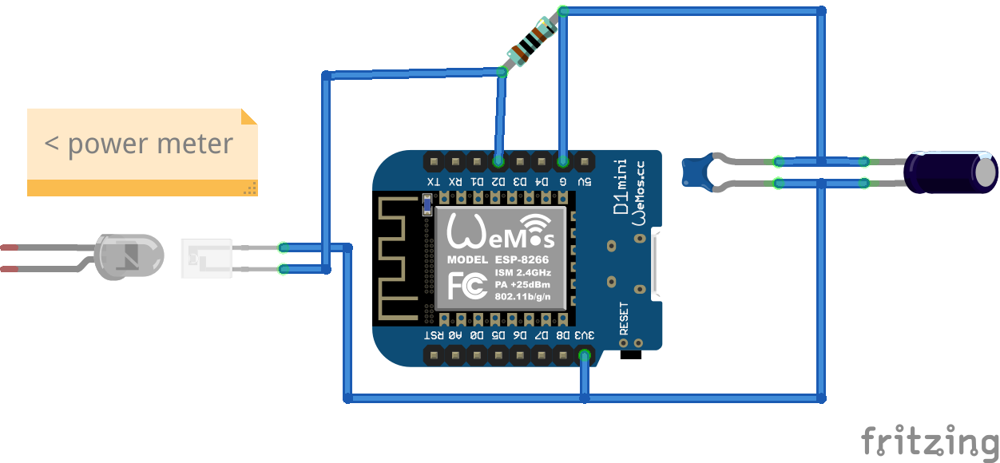
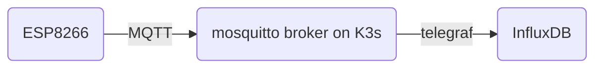

# home-monitoring

Project to monitor electricity, water and natural gas consumption.

## Commodities

### Electricity

Power meter is a Holleytech DTZ 541-ZEBA from or version 2021.  
The date is important since the SML byte order has changed from 2019 to 2021.

#### Sensor

As a write-read head I use a [Osram SFH 3100 F](https://www.osram.com/ecat/Radial%20Mini%20Sidelooker%20SFH%203100%20F/com/en/class_pim_web_catalog_103489/prd_pim_device_2219661/) phototransistor and 1 kOhm resistor. For testing purposes I cut a hole into a piece of cardboard at the position of the diode of the power meter.



### Gas

Not started yet.

### Water

Not started yet.

## Data processing

My approach is based on a K3s cluster on Raspberry Pis (because it is already available), but native or docker software deployment should work alike.



### Storage (InfluxDB)

Create namespace

```bash
kubectl create namespace home-mon
```

Add helm repository

```bash
helm repo add influxdata https://helm.influxdata.com/
```

Install InfluxDB

```bash
helm install influx influxdata/influxdb \
        --set image.tag=1.8.10 -n home-mon
```

## Credits

* https://fullstackenergy.com/mqtt-into-influx/
* https://makesmart.net/esp8266-d1-mini-mqtt/